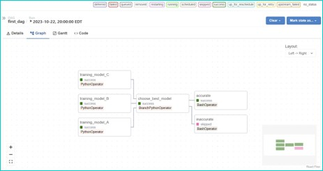
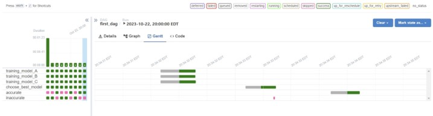

<h1>Project Description</h1> 

This project aims to execute an ETL pipeline by employing the Apache Airflow tool. Apache Airflow is an open-source tool to programmatically author, schedule, and monitor workflows. The repository contains three code files.

<h3>1. first_dag_working.py </h3> 
This code file tries to demonstrate basic workflow of Apache Airflow tool by defining a DAG and various tasks using different operators. Operators used are:

  * PythonOperator: Executes a Python function
  * BashOperator: Used for executing a Bash script
  * BranchPythonOperator: It is similar to the PythonOperator except that it requires a python_callable to return a task_id (or list of task_ids)

   

  The dependencies are then declared within these tasks using shift operator.

   

  The tasks' execution can be viewed in Apache Airflow Gantt view.

   

<h3>2. dag_crypto.py</h3>
  This file defines the DAG and the tasks to be executed inside it. The function defined in crypto_etl.py has been imported here so that the PythonOperator inside this DAG can call it.
  The DAG, when triggered, will call the function mentioned above and the task will be either executed successfully or go back to rescheduling.
  
<h3>3. crypto_etl.py</h3>
This code file contains the function which defines the ETL process inside:

  * First it pulls data from the URL using requests library.
  * Then transforms the data in a more structured format (JSON).
  * Finally, the transformed data is stored in a AWS S3 bucket.

  

  
  
